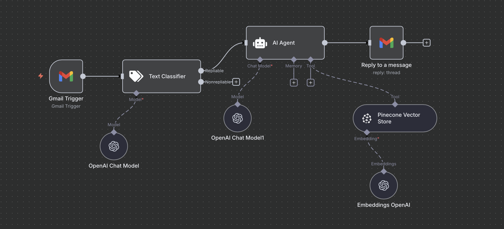

# 📧 Emailer Automation (AI-powered Gmail Auto-Responder)

This workflow is an **AI-driven email responder** built in n8n.  
It automatically monitors your Gmail inbox, classifies incoming emails, and uses OpenAI + Pinecone to generate intelligent, HTML-formatted replies.

---

## 🔄 What This Workflow Does

### **1. Triggers on every new email (Gmail Trigger)**
The workflow checks your Gmail inbox every minute and retrieves the snippet, message ID, thread ID, and metadata.

### **2. Classifies the email (Text Classifier)**
An LLM classifier categorizes the message into:

- **Repliable** → if the email mentions the company name “xyz”  
- **NonRepliable** → all other emails

Only “Repliable” emails continue through the workflow.

### **3. Runs an AI Agent to generate the response**
Using OpenAI + LangChain:

- Reads the email content  
- Retrieves company knowledge via Pinecone  
- Generates a support-style reply  
- Formats the output as **clean HTML**  
- Avoids adding a subject line  

### **4. Sends a reply via Gmail**
The workflow responds directly in the email thread using:

- `threadId`
- `messageId`
- HTML email content

---

## 🧱 Node Breakdown

| Node | Purpose |
|------|---------|
| **Gmail Trigger** | Detects new incoming emails |
| **Text Classifier (LangChain)** | Categorizes messages as Repliable or NonRepliable |
| **OpenAI Chat Model** | Supports the classifier with LLM reasoning |
| **AI Agent (LangChain)** | Generates the final support reply |
| **OpenAI Chat Model** | Core LLM used for response generation |
| **Pinecone Vector Store** | Provides internal company knowledge |
| **OpenAI Embeddings** | Embeddings for semantic search in Pinecone |
| **Gmail Reply Node** | Sends the HTML response back to the email thread |

---

## 🛠 Technologies Used

- n8n  
- Gmail API  
- OpenAI (GPT-4.1-mini)  
- LangChain Agent  
- Pinecone Vector Database  
- OpenAI Embeddings  
- HTML formatting  

---

## 🧪 How to Use

1. Import `workflow.json` into n8n  
2. Set up your credentials:
   - Gmail OAuth2  
   - OpenAI API  
   - Pinecone API  
3. Update:
   - “xyz” → your company name  
   - Pinecone index + namespace  
4. Activate the workflow  
5. Send an email mentioning the company name to test  

---

## 🔒 Security Notice

This workflow export does **not** include:

- API keys  
- OAuth tokens  
- Gmail account details  
- Credential files  

All sensitive data stays inside n8n's encrypted credential store.

---

## 🖼 Workflow Screenshot

